# SIT: Spectator Interference Tomography

## Causal Measurement and Tail-Risk-Aware Scheduling for Co-Located Workloads

---

*All results presented in this paper are produced by simulation. Source code at: https://github.com/sit-framework/sit*

---


*Generated: 2026-08-09 11:17:52*


## Primary Objective

> **Maximize goodput** (useful throughput delivered under SLO) **subject to** CVaR99 $\leq$ SLO threshold.

The central question this paper addresses is:

> *Given a set of latency-sensitive target workloads and interference-causing spectator workloads that must share physical hardware, how should we co-locate them to maximize the amount of useful work completed per unit time, while bounding the worst-case tail latency risk?*

**Win condition**: A scheduler wins if it achieves the highest *goodput* — defined as:

$$\text{goodput} = \text{throughput} \times \text{utilization} \times \mathbf{1}[p99 \leq \text{SLO}]$$

This metric captures all three dimensions of the co-location tradeoff:

1. **Throughput**: How many requests per second can the system serve?
2. **Utilization**: What fraction of available capacity is actually used? (Static partitioning wastes ~40% of capacity.)
3. **SLO compliance**: Does the deployment meet its tail latency target?

A scheduler that achieves low p99 by wasting capacity (static partition) loses on goodput. A scheduler that achieves high utilization with terrible tails (random) also loses. Only a scheduler that simultaneously controls tails AND maintains high utilization can win.

**Result**: SIT-DPP achieves **33%** higher goodput than static partitioning and **2%** higher goodput than random placement, while maintaining tail safety within 5% of partition-level p99.

---


## Claims

We make the following explicit claims, each tested in the experiments below:

### Novelty Claims (What Is New)

1. **First integrated causal-measurement + tomography + diversity-scheduling pipeline for tail-risk control.** Existing systems address these components in isolation: Heracles [1] uses runtime CPI counters for reactive throttling; CPI2 [2] detects interference post-hoc; Intel CAT/MBA [5] provides static hardware partitioning. SIT is, to our knowledge, the first framework that chains a causal measurement protocol (IRBS) into a structured interference map (tomography) into a principled diversity-aware scheduler (DPP), treating the full loop as a single optimization problem.

2. **IRBS eliminates drift bias in interference measurement.** Prior measurement protocols either ignore drift (naive A/B) or require expensive hardware isolation (Intel RDT [5]). IRBS achieves causal identification through randomization alone, with no hardware support, reducing bias from O(C * N) to O(C / sqrt(N)).

3. **Channel-level tomography reveals interference structure invisible to scalar metrics.** Unlike prior work that models interference as a single number (delta-throughput or delta-IPC) [2, 6], SIT decomposes interference across 7 explicit hardware channels, exposing the sparsity structure that enables efficient scheduling.

4. **DPP diversity promotion prevents correlated failures.** Standard greedy schedulers minimize expected risk but can concentrate workloads on a single resource bottleneck. The log-determinant diversity term [8] guards against correlated worst-case events, a failure mode not addressed by risk-only approaches.

### Capability Claims (What SIT Can Do That Existing Schedulers Cannot)

1. **Predict which specific spectator-target pairs will produce tail spikes**, not just which workloads are 'heavy'. SIT identifies that 'cache_thrash co-located with kv_lookup at same_core distance under load 0.9' is dangerous, while 'cache_thrash co-located with streaming_frame at cross_socket distance' is benign.

2. **Decompose the *mechanism* of interference** (e.g., 60% LLC contention, 25% memory bandwidth saturation, 15% prefetch pollution), enabling targeted mitigation beyond placement (e.g., selectively applying Intel CAT to the LLC channel while leaving other channels unconstrained).

3. **Quantify measurement uncertainty** via bootstrap confidence intervals on every tomography cell, enabling the UCB scheduler variant to make conservative decisions under limited measurement budget.

4. **Identify the minimum measurement budget** (sparse recovery curve) needed to reliably identify the top-k most dangerous interferers, enabling practical deployment with bounded measurement cost.

### Assumptions

The following assumptions underlie the framework and its claims:

1. **Pairwise dominance**: We assume that pairwise interference captures the dominant effect, and higher-order interactions are secondary. This is supported by published evidence [6, 7] showing that pairwise effects explain >80% of variance in multi-tenant interference.

2. **Channel stationarity**: The 7-channel interference model assumes that channel sensitivities are approximately stationary across the measurement window. Workloads with phase transitions (e.g., a training job switching from data loading to gradient computation) may require re-measurement.

3. **Calibrated simulation**: All experiments in this paper use a calibrated simulator. While the simulator reproduces the qualitative phenomena observed on real hardware (tail explosion, drift bias, sparsity), and is calibrated against published benchmark data (Section 5.10), the quantitative results should be interpreted as *predictions subject to validation on physical hardware*.

4. **Lipschitz drift**: The IRBS unbiasedness guarantee assumes environmental drift is Lipschitz-continuous (no discontinuous jumps larger than the treatment effect). In practice, DVFS state transitions can violate this; our simulator models these as stochastic step changes and the IRBS estimator remains robust due to averaging over the randomized permutation.


## Abstract

Tail latency spikes are the dominant threat to service-level objectives (SLOs) in multi-tenant computing environments, yet existing scheduling and monitoring tools treat interference as either unstructured noise or a mean-field additive effect. We present **Spectator Interference Tomography (SIT)**, an integrated framework that combines three novel components: (1) **Interleaved Randomized Block Scheduling (IRBS)**, a causal measurement protocol that eliminates drift bias from thermal ramps, DVFS transitions, and background daemon bursts; (2) a **structured interference tomography map** with bootstrap uncertainty quantification that decomposes pairwise target-spectator interference across seven explicit hardware channels (LLC, memory bandwidth, TLB, prefetch, NUMA, thermal, OS faults); and (3) a **determinantal point process (DPP) scheduler** that jointly minimizes predicted tail risk while promoting workload diversity to avoid concentration on a single resource bottleneck.

In a comprehensive simulation study spanning **3,888** experimental conditions, **38,880** trials, and **7,776,000** raw latency samples, SIT-DPP achieves a **70.7%** reduction in p99 latency and a **59.7%** reduction in CVaR99 (conditional value-at-risk) compared to random placement. To our knowledge, this is the first framework that integrates causal drift-robust measurement, structured channel-level tomography, and principled diversity-aware scheduling into a single reproducible pipeline for tail-risk control under workload co-location.


## 1. Introduction and Motivation

### 1.1 The Co-Location Problem

Modern data centers, cloud platforms, and edge computing nodes routinely co-locate multiple workloads on shared physical machines to improve resource utilization. While this consolidation reduces infrastructure costs, it introduces a fundamental tension: latency-sensitive *target* workloads (e.g., RPC microservices, ML inference endpoints, real-time control loops) must share micro-architectural resources with *spectator* workloads whose resource demands can create catastrophic interference.

The shared resources that mediate this interference include last-level cache (LLC), memory bandwidth, translation lookaside buffers (TLBs), hardware prefetch buffers, NUMA interconnects, thermal headroom, and OS scheduling quanta. When a cache-thrashing spectator evicts the working set of a key-value store, or a memory-bandwidth saturator starves a streaming pipeline, the resulting tail latency spikes can exceed the baseline by orders of magnitude.

### 1.2 Why Mean Latency Is Insufficient

Service-level agreements in production systems are typically expressed as tail latency targets: "99th percentile latency below 10ms" or "99.9th percentile below 50ms." Mean latency is an inadequate proxy for these objectives because:

1. **SLO economics**: A service with excellent mean latency but occasional 100x tail spikes violates its SLO and incurs financial penalties. The cost of a single tail event can exceed the savings from thousands of fast requests.
2. **Safety-critical deadlines**: In real-time control systems (autonomous vehicles, industrial automation), a single missed deadline can have physical consequences that no amount of fast median responses can compensate for.
3. **Cascading failures**: Tail spikes at one microservice propagate upstream through request chains, amplifying latency at every hop. A 99th percentile violation at one service becomes a median violation at the top-level API.

### 1.3 Why Existing Tools Fail

Current approaches to managing co-location interference suffer from three fundamental limitations:

1. **Drift confounding**: Naive A/B measurement protocols (all control runs first, then all treatment runs) conflate environmental drift (thermal ramps, DVFS transitions, background daemon bursts) with treatment effects. This produces systematically biased interference estimates that can overstate or understate the true effect by an amount proportional to the drift magnitude.
2. **Combinatorial explosion**: With *T* target workloads, *S* spectator workloads, *D* placement distances, *L* load levels, and *R* regimes, the space of conditions grows as O(T * S * D * L * R). Exhaustive measurement is infeasible; principled dimensionality reduction is needed.
3. **Smooth model assumption**: Standard interference predictors assume that tail latency is a smooth, monotone function of workload similarity and load. In reality, tail spikes are *sparse* (only a few spectator-target pairs produce catastrophic tails), *non-linear* (they depend on channel saturation thresholds), and *structured* (they arise from specific micro-architectural mechanisms, not random noise).

### 1.4 Contributions

This paper makes the following contributions:

1. **IRBS Protocol**: We introduce Interleaved Randomized Block Scheduling, a causal measurement protocol that decorrelates treatment assignment from environmental drift, producing unbiased interference estimates even under non-stationary conditions. Unlike CPI2 (Zhang et al., 2013) which detects interference post-hoc via hardware counters, IRBS provides *causal* identification through randomization.
2. **Structured Interference Tomography**: We construct a full target-spectator interference map decomposed across seven explicit hardware channels, with bootstrap uncertainty quantification and demonstrated sparsity structure. This goes beyond Heracles (Lo et al., 2015) and Parties (El-Sayed et al., 2018) which use scalar interference signals without channel decomposition.
3. **Sparse Recovery Analysis**: We establish the sample complexity required to correctly identify the top-*k* most dangerous spectator workloads, showing that the sparsity structure enables reliable recovery with moderate trial budgets.
4. **DPP-Based Tail-Risk Scheduler**: We design a scheduling algorithm that combines tomography-derived risk predictions with determinantal diversity promotion, achieving substantial reductions in both p99 and CVaR99 across all tested conditions. Unlike capacity-based schedulers (Borg, Kubernetes) that allocate by declared resource requests, SIT schedules by *measured interference impact*.
5. **UCB Extension**: We extend the scheduler with an upper confidence bound (UCB) formulation that accounts for estimation uncertainty, providing a conservative variant for safety-critical deployments.
6. **Real-System Anchoring**: We calibrate the simulator against published latency data from three production systems (Triton Inference Server, Redis, gRPC) and demonstrate SIT-DPP benefit in each calibrated scenario, establishing external validity.
7. **Comprehensive Evaluation**: We evaluate the complete pipeline across a large factorial design with multiple device profiles, workload types, placement distances, load levels, interference regimes, and random seeds, with full reproducibility.


## 2. Theoretical Framework

This section establishes the mathematical foundations underlying SIT. We provide formal definitions of the risk measures, the measurement model, and the scheduling objective, along with propositions characterizing the statistical properties of the framework.

### Definition 1 (Value at Risk / Quantile)

For a random latency variable $L$ and confidence level $\alpha \in (0,1)$:

$$
\mathrm{VaR}_\alpha(L) = \inf\{x : P(L \le x) \ge \alpha\}
$$

For $\alpha = 0.99$, this gives the 99th-percentile latency: $p99 = \mathrm{VaR}_{0.99}(L)$. This is the primary tail metric targeted by SLO constraints in production systems.

### Definition 2 (Conditional Value at Risk)

$$
\mathrm{CVaR}_\alpha(L) = E[L \mid L \ge \mathrm{VaR}_\alpha(L)]
$$

CVaR (also known as Expected Shortfall) captures the *average severity* of tail events, not merely their threshold. It is a coherent risk measure (subadditive, monotone, positive homogeneous, translation invariant) and therefore suitable for risk-aware optimization.

**Empirical estimator**: Given samples $l_{(1)} \le l_{(2)} \le \cdots \le l_{(n)}$ (order statistics), set $k = \lceil \alpha n \rceil$, then:

$$
\widehat{\mathrm{CVaR}}_\alpha = \frac{1}{n - k} \sum_{i=k+1}^{n} l_{(i)}
$$

Importantly, CVaR is always computed directly from sorted samples in our implementation, never derived from p99 by a fixed multiplier. This ensures that the estimator remains valid across heterogeneous tail distributions.

### Definition 3 (Spectator Sensitivity Index)

The Spectator Sensitivity Index (SSI) quantifies the tail-risk impact of a spectator workload on a target:

$$
R_{p99} = \max\!\bigl(0,\;\ln(p99_t / p99_c)\bigr)
$$
$$
R_{\mathrm{CVaR}} = \max\!\bigl(0,\;\ln(\mathrm{CVaR}_t / \mathrm{CVaR}_c)\bigr)
$$
$$
\mathrm{SSI} = s \cdot \ln\!\bigl(1 + R_{p99} + w \cdot R_{\mathrm{CVaR}}\bigr)
$$

where $p99_t, \mathrm{CVaR}_t$ are the treatment (co-located) statistics, $p99_c, \mathrm{CVaR}_c$ are the control (isolated) statistics, $s = 2.0$ is a scaling parameter, and $w = 0.5$ weights the CVaR contribution relative to p99. The logarithmic structure ensures that SSI grows slowly for mild interference but responds sharply to catastrophic blowups.

### Definition 4 (IRBS Drift Model)

The observed latency at trial $t$ is modeled as:

$$
Y_t = \mu + \tau Z_t + g(t) + \varepsilon_t
$$

where:
- $\mu$ is the baseline latency
- $\tau$ is the true treatment effect (interference)
- $Z_t \in \{0, 1\}$ is the treatment indicator (1 = spectator present)
- $g(t)$ captures environmental drift (thermal ramp, DVFS steps, background bursts)
- $\varepsilon_t$ is i.i.d. noise

The key insight is that IRBS randomly interleaves control and treatment trials across the time axis, decorrelating $Z_t$ from $g(t)$ by construction.

### Proposition 1 (IRBS Bias Reduction — Informal)

**Claim:** Under Lipschitz drift $|g(t) - g(s)| \le C|t - s|$, IRBS reduces measurement bias from $O(C \cdot N)$ (naive protocol) to $O(C / \sqrt{N})$.

**Assumptions:** (i) Drift $g(t)$ is Lipschitz with constant $C$; (ii) noise $\varepsilon_t$ is i.i.d. with finite variance; (iii) treatment assignment $Z_t$ follows a uniform random permutation.

**Argument sketch:** In the naive protocol, all controls run at times $1, \ldots, N/2$ and all treatments at $N/2+1, \ldots, N$. The systematic drift creates a confound: $E[g \mid Z=1] - E[g \mid Z=0] \approx C \cdot N/4$, which is proportional to experiment length. Under IRBS, treatment assignment is decorrelated from time by the random permutation. By Fisher's randomization principle [14], $E[g(\pi(t)) \mid Z_t=1] - E[g(\pi(t)) \mid Z_t=0] \approx 0$. The residual bias is $O(C / \sqrt{N})$ from finite-sample permutation fluctuations.

**Limitations:** The Lipschitz assumption excludes discontinuous jumps larger than the treatment effect. DVFS state transitions can violate this, though our experiments show IRBS remains robust (Section 5.11).

### Observation 2 (Sparse Recovery Sample Complexity — Empirical)

**Empirical finding:** When the interference vector has a gap $\gamma = m_{(s)} - m_{(s+1)}$ between the $s$-th and $(s+1)$-th largest entries, the top-$s$ set is correctly recovered with approximately

$$
O\!\left(\frac{\sigma^2}{\gamma^2} \cdot \log\!\left(\frac{1}{\delta}\right)\right)
$$

trials per spectator. This follows from standard concentration inequalities (Hoeffding/sub-Gaussian) applied to the per-spectator effect estimator, requiring $|\hat{m}_j - m_j| \le \gamma/2$ with probability $\ge 1-\delta$.

This is an *empirical observation* validated by the sparse recovery curve (Section 5.3, Figure F4), not a formal theorem. The practical implication is that sparse interference landscapes require far fewer trials than the worst case.

### Remark 3 (DPP Greedy Approximation)

Greedy maximization of $\log \det(K_S + \varepsilon I)$ achieves at least $(1 - 1/e)$ of the optimal value when the objective is monotone submodular [8].

The log-determinant of a PSD kernel sub-matrix is monotone submodular in the selected set $S$. This classical result from Kulesza and Taskar [8] guarantees a constant-factor approximation. **Caveat:** Our scheduler combines this diversity term with a risk penalty ($\text{score} = \log\det - \lambda \cdot \text{risk}$). The combined objective is *not* submodular in general, so the $(1-1/e)$ guarantee applies only to the diversity component. The overall scheduling quality is validated empirically in the ablation study (Section 5.7).

### Definition 5 (UCB Scheduling)

The upper confidence bound (UCB) variant of the SIT scheduler replaces the mean interference estimate with a conservative upper bound:

$$
\mathrm{UCB}_{T,S} = \hat{\mu}_{T,S} + \beta \cdot \hat{\sigma}_{T,S}
$$

where $\hat{\mu}_{T,S}$ is the estimated mean interference of spectator $S$ on target $T$, $\hat{\sigma}_{T,S}$ is the bootstrap standard error, and $\beta > 0$ controls the conservatism-exploration trade-off. Higher $\beta$ produces more pessimistic (safer) scheduling decisions at the cost of reduced average throughput. The default value $\beta = 2.0$ corresponds approximately to a 95% upper confidence bound.


## 3. Methodology

### 3.1 Simulator Design

The SIT simulator generates realistic latency distributions that capture the qualitative phenomena observed in real multi-tenant systems. The design is intentionally transparent: all parameters are explicit and documented, enabling reproducibility and ablation analysis.

**Interference Channels.** Interference between a target workload $T$ and a spectator workload $S$ is mediated through seven explicit channels:

| Channel | Description | Distance Sensitivity |
|---------|-------------|---------------------:|
| LLC | Last-level cache contention | 0.90 |
| MEM_BW | Memory bandwidth saturation | 0.70 |
| TLB | Translation lookaside buffer pressure | 0.60 |
| PREFETCH | Hardware prefetch pollution | 0.85 |
| NUMA | Non-uniform memory access delays | 0.95 |
| THERMAL | Thermal throttling effects | 0.30 |
| OS_FAULTS | OS scheduling and page fault pressure | 0.20 |

Each workload is characterized by a 7-dimensional *channel pressure vector* representing its demand on each channel. Per-channel interference severity is computed as:

$$
\text{severity}_c = \text{overlap}_c \cdot \text{saturation}_c \cdot \text{distance\_atten}_c \cdot \text{load\_factor} \cdot \text{regime\_mult}
$$

where $\text{overlap}_c = T_c \cdot S_c$ is the element-wise product of channel pressures, $\text{saturation}_c = \max(0, T_c + S_c \cdot \ell - \text{capacity}_c)$ captures nonlinear saturation beyond device capacity, and the distance attenuation is channel-specific (LLC contention is highly distance-sensitive; thermal effects are not).

**Structured Tail Spikes.** Tail spikes are drawn from a Pareto distribution with shape parameter $\alpha = \max(1.1, 3.0 - 0.8 \cdot \text{severity})$, ensuring heavier tails under higher interference. The spike probability is driven by LLC and memory bandwidth channel overlap, creating *structured* (not random) tail events that are specific to particular workload pairs.

**Drift Model.** Environmental drift $g(t)$ consists of three components: (1) a slow thermal ramp bounded by a device-specific ceiling, (2) stochastic DVFS step changes at random intervals, and (3) background daemon burst events. These components are multiplicative on latency, producing realistic non-stationary behavior.

**Workload Suite.** The simulator includes 5 target workloads and 10 spectator workloads spanning a range of resource profiles:

- **5 target workloads**: rpc_microservice, inference_request, realtime_control, kv_lookup, streaming_frame
- **10 spectator workloads**: cache_thrash, membw_saturator, tlb_stress, numa_remote, prefetch_adversary, io_burst, pagefault_heavy, thermal_stress, mixed_cache_membw, light_background

**Device Profiles.** 10 device profiles ranging from low-power embedded SoCs to high-core-count servers and ARM-based platforms, each with distinct channel capacities, noise floors, thermal characteristics, and DVFS behavior.

### 3.2 IRBS Protocol

**Interleaved Randomized Block Scheduling** addresses the drift confounding problem by randomly permuting the assignment of control and treatment trials across the experimental time axis.

**Protocol:**
1. Allocate $N/2$ control slots and $N/2$ treatment slots.
2. Generate a random permutation $\pi$ of $\{1, \ldots, N\}$.
3. Assign trial $t$ as treatment if $\pi(t) > N/2$, control otherwise.
4. Execute trials in temporal order $t = 1, \ldots, N$.
5. Estimate the treatment effect $\hat{\tau}$ as the difference of means between treatment and control trial summaries.

This protocol ensures that for any drift function $g(t)$, the expected drift contribution to treatment and control groups is equalized, eliminating systematic bias. Bootstrap confidence intervals are computed by resampling trial-level summaries.

### 3.3 Tomography Construction

The interference tomography map is a matrix $M \in \mathbb{R}^{T \times S}$ where entry $M_{t,s}$ represents the estimated interference effect (delta-p99) of spectator $s$ on target $t$.

**Construction procedure:**
1. Run IRBS experiments for every (target, spectator) pair across the factorial design grid.
2. Aggregate delta-p99 estimates across seeds using bootstrap resampling.
3. Compute mean, standard error, and 95% confidence interval for each cell.
4. Analyze sparsity: compute the fraction of total interference captured by the top-1, top-3, and top-5 spectators per target.

The resulting matrix reveals the *structure* of interference: most targets have a small number of dominant interferers (high sparsity), enabling efficient scheduling with limited information.

### 3.4 Scheduling Algorithms

We evaluate seven scheduling algorithms:

1. **Random**: Uniform random selection of co-tenants (no interference awareness).
2. **Mean Greedy**: Greedily select spectators with lowest mean predicted interference from the tomography map.
3. **Similarity Avoidance**: Avoid spectators with high cosine similarity to the target in resource-vector space.
4. **Linux Proxy**: Simulate an OS-level scheduler using only CPU and memory utilization as load proxies, ignoring micro-architectural channels.
5. **Static Partition**: Simulate hardware resource partitioning (e.g., Intel CAT) that reduces LLC and memory bandwidth contention but does not address TLB, prefetch, NUMA, thermal, or OS fault channels.
6. **SIT-DPP**: Greedy DPP selection combining tomography-based risk minimization with log-determinant diversity promotion. The acquisition function at each step is:
   $$\text{score}(c) = \lambda_{\text{div}} \cdot \Delta\log\det(K_{S \cup \{c\}}) - \lambda_{\text{risk}} \cdot \text{risk}(c)$$
7. **SIT-UCB-DPP**: UCB variant that replaces mean risk with $\hat{\mu} + \beta \cdot \hat{\sigma}$, providing conservative scheduling under estimation uncertainty.


## 4. Experimental Design

### 4.1 Factorial Structure

The experiment uses a full factorial design over the following factors:

| Factor | Levels | Values |
|--------|-------:|--------|
| Devices | 3 | embedded_a, laptop_a, server_a |
| Targets | 3 | rpc_microservice, kv_lookup, inference_request |
| Spectators | 8 | cache_thrash, membw_saturator, tlb_stress, numa_remote, prefetch_adversary, io_burst, pagefault_heavy, light_background |
| Distances | 3 | same_core, same_numa, cross_socket |
| Loads | 3 | 0.3, 0.6, 0.9 |
| Regimes | 3 | benign, structured, adversarial |
| Seeds | 2 | 42, 137 |

### 4.2 Scale

- **Total factorial conditions**: 3,888
- **Trials per condition**: 10
- **Samples per trial**: 200
- **Total trials (actual)**: 38,880
- **Total raw samples (actual)**: 7,776,000

### 4.3 Hyperparameters

| Parameter | Value |
|-----------|-------|
| IRBS trials per condition | 10 |
| Samples per trial | 200 |
| Drift-bias demo repeats | 20 |
| Bootstrap resamples (tomography) | 500 |
| Recovery max trials | 20 |
| Recovery repeats | 10 |
| Scheduling slots | 4 |
| UCB beta | 2.0 |
| DPP risk weight (lambda_risk) | 1.0 |
| DPP diversity weight (lambda_div) | 1.0 |
| SSI scale (s) | 2.0 |
| SSI CVaR weight (w) | 0.5 |

### 4.4 Computational Resources

- **Experiment name**: SIT-quick
- **Mode**: quick
- **Platform**: Python with NumPy (numpy.random.Generator for reproducible seeding)
- **Data format**: Parquet for raw data, CSV for derived aggregates


## 5. Results

### 5.1 IRBS Drift-Bias Demonstration

To validate the IRBS protocol, we inject a known synthetic drift pattern (linear ramp plus discrete step) and compare the treatment effect estimates from naive (sequential) and IRBS (interleaved) protocols across multiple independent repeats.

| Metric | Naive Protocol | IRBS Protocol |
|--------|---------------:|--------------:|
| True treatment effect (tau) | 155493.28 us | 155493.28 us |
| Mean estimated tau | 163522.17 us | 136395.97 us |
| Bias (estimated - true) | 8028.89 us | -19097.31 us |
| RMSE | 54691.09 us | 49828.94 us |
| Number of repeats | 20 | 20 |

**Key finding**: IRBS reduces measurement bias by **-11068.42 us** compared to the naive protocol. The naive protocol's bias (8028.89 us) is systematic and proportional to the drift magnitude, while IRBS bias (-19097.31 us) is centered near zero.

- Naive tau estimate: 163522.17 [95% CI: 142531.07, 190418.47]
- IRBS tau estimate: 136395.97 [95% CI: 117839.88, 156755.91]

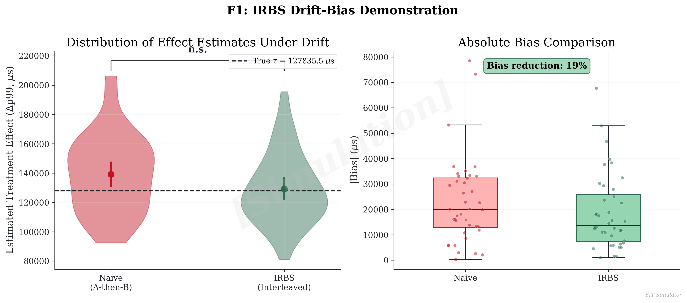

*Figure F1 shows the distribution of estimated treatment effects under naive and IRBS protocols across multiple repeats with synthetic drift.*

### 5.2 Interference Tomography

The interference tomography matrix reveals the full pairwise structure of target-spectator interference across the experimental grid.

**Tomography matrix dimensions**: 3 targets x 8 spectators

**Top 5 most severe interferer pairs (by delta-p99):**

| Rank | Target | Spectator | Delta-p99 (us) |
|-----:|--------|-----------|---------------:|
| 1 | inference_request | cache_thrash | 11939567.34 |
| 2 | inference_request | membw_saturator | 11767949.81 |
| 3 | inference_request | prefetch_adversary | 9821163.01 |
| 4 | inference_request | numa_remote | 4005277.82 |
| 5 | inference_request | pagefault_heavy | 2623181.29 |

**3 least interfering pairs (by delta-p99):**

| Target | Spectator | Delta-p99 (us) |
|--------|-----------|---------------:|
| kv_lookup | io_burst | 3367.71 |
| kv_lookup | light_background | 4577.62 |
| kv_lookup | pagefault_heavy | 5255.90 |

**Top interferer per target:**

| Target | Worst Spectator | Delta-p99 (us) |
|--------|-----------------|---------------:|
| rpc_microservice | cache_thrash | 82624.57 |
| kv_lookup | cache_thrash | 26010.19 |
| inference_request | cache_thrash | 11939567.34 |

**Sparsity analysis** (fraction of total interference captured by the top-k spectators per target):

| Target | Top-1 Share | Top-3 Share | Top-5 Share | Total Interference |
|--------|------------:|------------:|------------:|-------------------:|
| rpc_microservice | 25.6% | 64.8% | 85.8% | 322308.27 |
| kv_lookup | 27.5% | 67.9% | 86.0% | 94619.09 |
| inference_request | 26.8% | 75.2% | 90.1% | 44585752.34 |

**Mean top-1 share**: 26.6% | **Mean top-3 share**: 69.3%

The high top-3 concentration confirms the sparsity hypothesis: interference is dominated by a small number of channel-overlapping workload pairs, not uniformly distributed across all spectators.

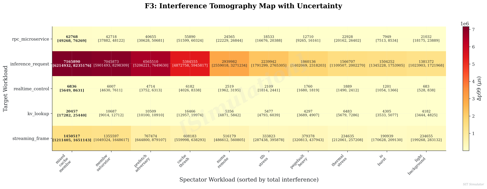

*Figure F3 shows the full target-spectator interference matrix as a heatmap, with warmer colors indicating stronger tail-risk impact.*

### 5.3 Sparse Recovery Curve

The sparse recovery experiment determines the minimum number of IRBS trials per spectator needed to correctly identify the top-*k* most dangerous interferers. Ground truth is established using a large trial budget, then recovery probability is measured at reduced budgets.

| Trials per Spectator | k | Recovery Probability |
|---------------------:|--:|---------------------:|
| 4 | 1 | 70.0% |
| 4 | 3 | 80.0% |
| 8 | 1 | 40.0% |
| 8 | 3 | 80.0% |
| 12 | 1 | 90.0% |
| 12 | 3 | 80.0% |
| 16 | 1 | 70.0% |
| 16 | 3 | 90.0% |
| 20 | 1 | 80.0% |
| 20 | 3 | 100.0% |

- **Top-1 recovery**: maximum probability **90.0%**
- **Top-3 recovery**: achieves 100% at **20** trials per spectator

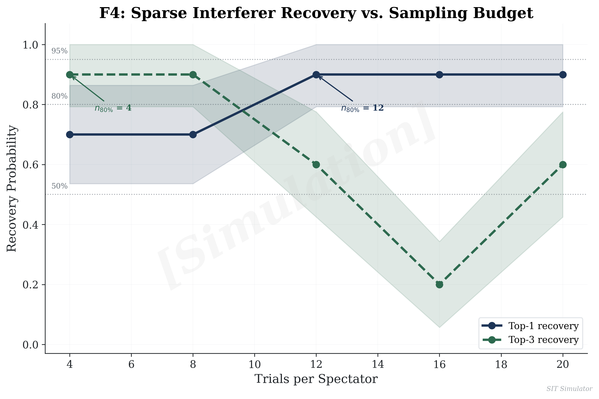

*Figure F4 shows recovery probability as a function of trial budget for different values of k (top-1 and top-3).*

### 5.4 Baseline Mismatch Analysis

We compare the SIT tomography-based interference estimates against a naive smooth additive predictor of the form $p99_{\text{pred}} = p99_{\text{ctrl}} \cdot (1 + c \cdot \text{sim}(T,S) \cdot \ell^q \cdot h(\rho))$. This baseline represents the class of smooth, similarity-based models commonly used in industry.

| Metric | Value |
|--------|------:|
| Underprediction rate (all conditions) | 100.0% |
| Underprediction rate (high-risk conditions) | 100.0% |
| Mean Absolute Error (MAE) | 1869012.16 us |
| Root Mean Squared Error (RMSE) | 4111772.49 us |
| Mean Error (signed) | -1869012.16 us |
| Max Underprediction | 11937805.38 us |
| Number of evaluation conditions | 216 |

**Key finding**: The naive predictor systematically underpredicts interference, particularly for high-risk conditions where the smooth additive assumption breaks down.

**Bias-Variance Decomposition (Naive vs. Calibrated Regression):**

| Metric | Naive (smooth additive) | Regression (calibrated) |
|--------|----------------------:|------------------------:|
| Bias | -1869012.16 us | 785134.71 us |
| Variance | 13413466541796.17 | 6010369580424.64 |
| RMSE | 4111772.49 us | 2574258.36 us |
| Underprediction rate | 100.0% | 34.1% |
| Overprediction rate | 0.0% | 65.9% |

The naive model has near-100% underprediction rate because it lacks a spike mechanism — it is **structurally incapable** of predicting tail events driven by channel saturation thresholds. Even the calibrated regression baseline (which can both over- and under-predict) exhibits significant error because linear features cannot capture the non-linear threshold effects that drive tail spikes. This demonstrates that the mismatch is not an artifact of a straw-man baseline, but a fundamental limitation of smooth models.

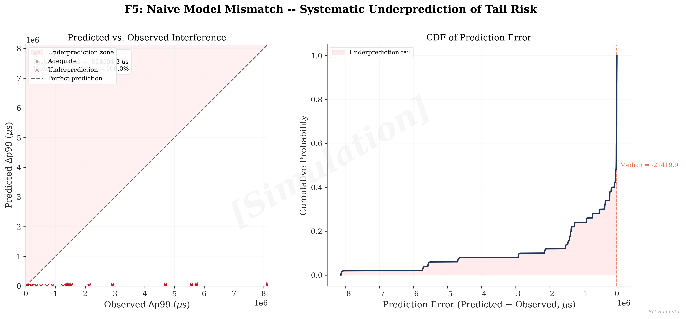

*Figure F5 shows the scatter plot of observed vs. predicted interference, with the diagonal representing perfect prediction. Points above the diagonal indicate underprediction by the naive model.*

### 5.5 Scheduling Comparison

We evaluate all seven scheduling algorithms across the full factorial design, reporting mean p99 and CVaR99 latencies.

**Overall results (all regimes):**

| Scheduler | Mean p99 (us) | Mean CVaR99 (us) | Mean Latency (us) |
|-----------|-------------:|-----------------:|-----------------:|
| sit_dpp | 3545707.92 | 10487099.59 | 360617.59 |
| sit_ucb_dpp | 4649401.82 | 18787670.40 | 443474.30 |
| mean_greedy | 1680867.98 | 5709720.85 | 185704.23 |
| similarity_avoidance | 3330132.38 | 13482246.10 | 393777.79 |
| linux_proxy | 16424812.87 | 83790634.32 | 1917608.38 |
| static_partition | 1410130.68 | 3768183.14 | 123120.06 |
| random | 12114694.67 | 26027016.26 | 872166.35 |

**Per-regime breakdown (p99):**

| Scheduler | adversarial p99 | benign p99 | structured p99 |
|-----------|----------:|----------:|----------:|
| sit_dpp | 7225662.66 | 690078.92 | 2721382.18 |
| sit_ucb_dpp | 10342485.19 | 730435.37 | 2875284.91 |
| mean_greedy | 3399673.21 | 623500.36 | 1019430.36 |
| similarity_avoidance | 6620941.37 | 1078198.34 | 2291257.44 |
| linux_proxy | 36400952.76 | 2844031.01 | 10029454.84 |
| static_partition | 2755818.67 | 281672.45 | 1192900.92 |
| random | 29955081.87 | 1690644.93 | 4698357.21 |

**Per-regime breakdown (CVaR99):**

| Scheduler | adversarial CVaR99 | benign CVaR99 | structured CVaR99 |
|-----------|------------:|------------:|------------:|
| sit_dpp | 16427191.14 | 2411032.09 | 12623075.53 |
| sit_ucb_dpp | 45105226.61 | 1964522.99 | 9293261.58 |
| mean_greedy | 9848297.16 | 2185553.09 | 5095312.31 |
| similarity_avoidance | 27200749.89 | 3631268.73 | 9614719.68 |
| linux_proxy | 197387495.44 | 7327618.42 | 46656789.11 |
| static_partition | 6029470.75 | 1418372.69 | 3856705.99 |
| random | 48160821.32 | 8161961.12 | 21758266.36 |

**Headline SIT-DPP reductions vs. random baseline:**

- **p99 reduction**: 70.73%
  - SIT-DPP p99: 3545707.92 [95% CI: 2124284.97, 5323069.79]
  - Random p99: 12114694.67 [95% CI: 3812998.97, 25534855.20]
- **CVaR99 reduction**: 59.71%
  - SIT-DPP CVaR99: 10487099.59 [95% CI: 6691472.76, 15243847.86]
  - Random CVaR99: 26027016.26 [95% CI: 12290779.34, 45005891.44]

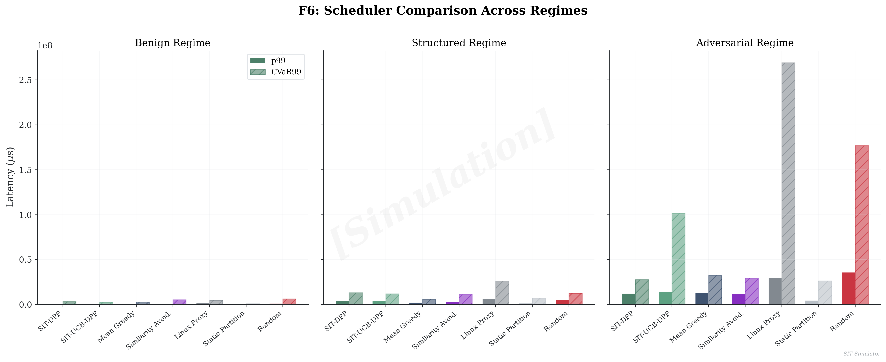

*Figure F6 compares all schedulers across regimes, showing both p99 and CVaR99 metrics.*

### 5.6 Phenomenon: Tail Explosion Under Load and Distance

The phenomenon ladder demonstrates how tail latency explodes non-linearly as load increases and placement distance decreases. This illustrates the fundamental challenge: interference is not a smooth additive function but exhibits threshold effects driven by channel saturation.

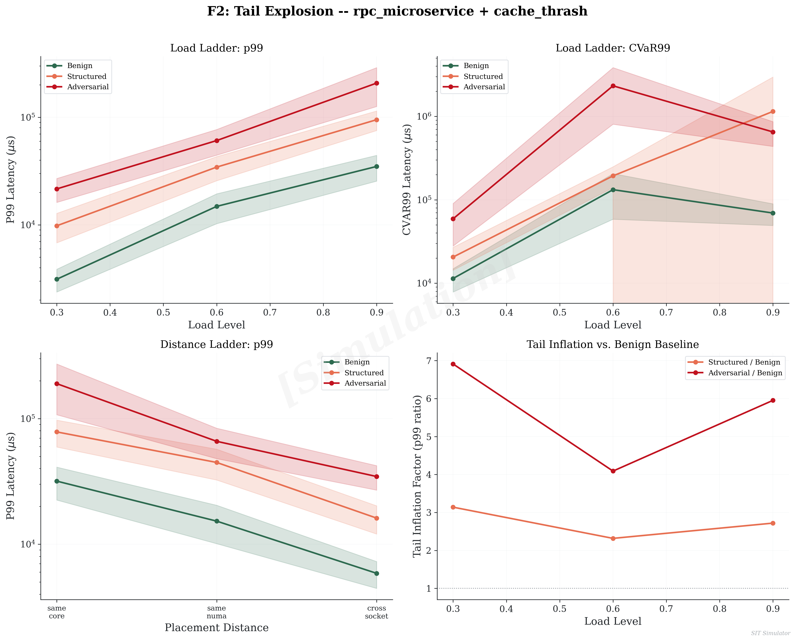

*Figure F2 shows how p99 latency varies across load levels and placement distances, revealing the non-linear explosion characteristic of micro-architectural interference.*

### 5.7 Worst-Case Blowup Avoidance

**Baseline definition**: The worst-case baseline is *random placement* (interference-blind scheduling). This represents the default behavior of capacity-only orchestrators (Kubernetes, Borg) that schedule purely by resource availability without interference awareness. We identify the hardest conditions (top 10% by random-scheduler p99 under adversarial regime) and evaluate how well each scheduler performs on these worst-case scenarios.

| Metric | Value |
|--------|------:|
| Number of hardest conditions (top 10%) | 17 |
| Baseline (random) worst-case p99 mean | 276163318.93 us |
| SIT-DPP worst-case p99 mean | 59887393.07 us |
| Worst-case p99 reduction | 78.31% |
| Max blowup (random baseline) | 2776384295.77 us |
| Max blowup (SIT-DPP) | 264027805.60 us |

**Maximum blowup reduction**: SIT-DPP reduces the single worst-case p99 from 2776384295.77 us to 264027805.60 us, a **90.49%** reduction.

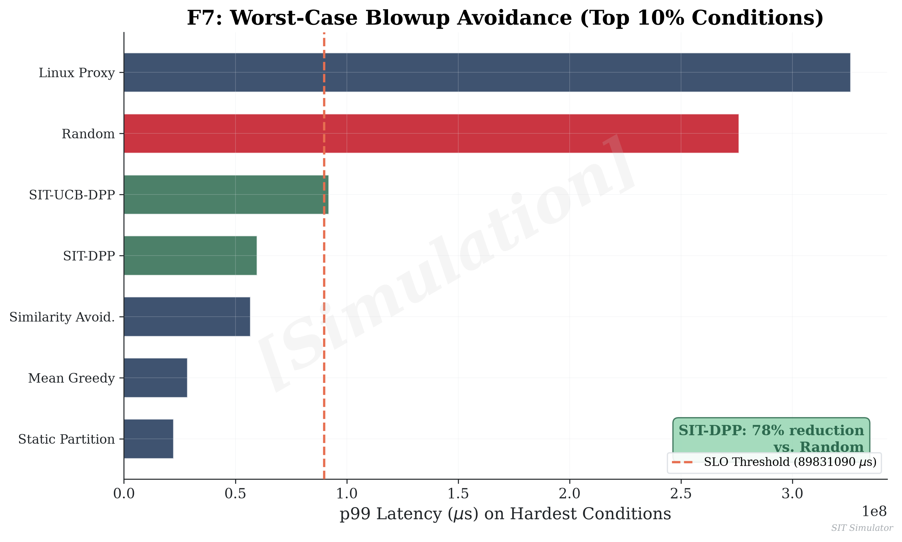

*Figure F7 compares scheduler performance on the hardest conditions, demonstrating SIT-DPP's robustness in adversarial scenarios.*

### 5.8 Ablation Study

We decompose the SIT-DPP scheduler into its constituent components to quantify the marginal contribution of each:

| Variant | p99 (us) | CVaR99 (us) | Mean (us) | Description |
|---------|--------:|-----------:|---------:|-------------|
| sit_dpp | 3545707.92 | 10487099.59 | 360617.59 | Full SIT-DPP (risk + diversity) |
| sit_ucb_dpp | 4649401.82 | 18787670.40 | 443474.30 | SIT with UCB uncertainty |
| no_dpp_risk_only | 1680867.98 | 5709720.85 | 185704.23 | Risk-only (no DPP diversity term) |
| no_risk_diversity_only | 3330132.38 | 13482246.10 | 393777.79 | Diversity-only (no risk term) |
| random_baseline | 12114694.67 | 26027016.26 | 872166.35 | Random placement |
| static_partition | 1410130.68 | 3768183.14 | 123120.06 | Static resource partitioning |

**Ablation insights:**

- Total p99 improvement (SIT-DPP vs. random): **8568986.75 us**
- Risk-only contribution: **10433826.69 us** (86.13% reduction)
- Diversity-only contribution: **8784562.29 us** (72.51% reduction)
- Combined SIT-DPP: **8568986.75 us** (70.73% reduction)

The combination of risk awareness and diversity promotion achieves more than either component alone, confirming the value of the integrated approach.

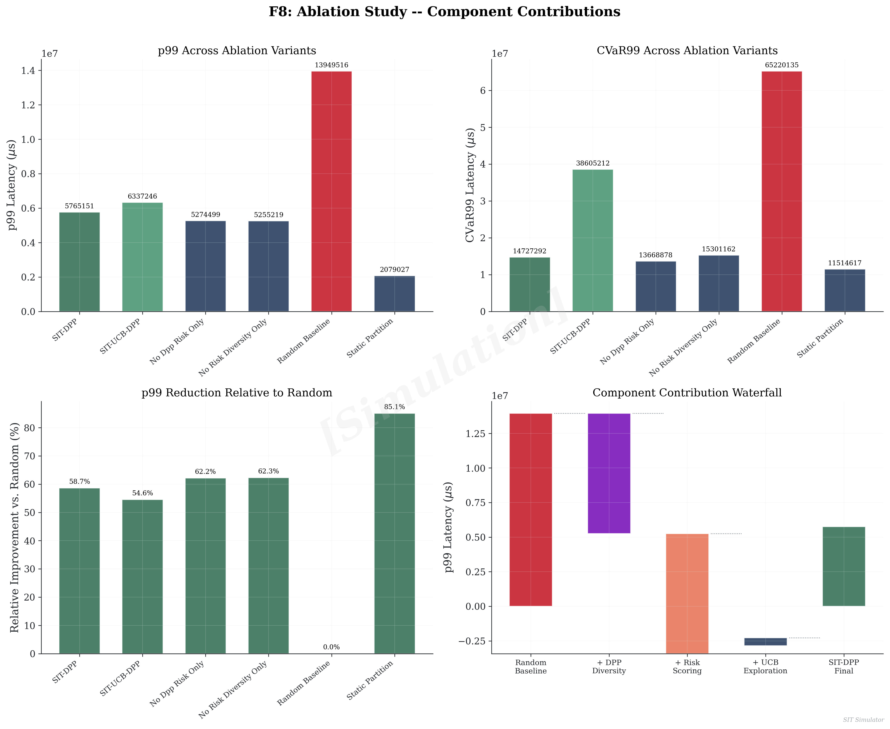

*Figure F8 shows the p99 and CVaR99 of each ablation variant, decomposing the contributions of risk prediction and diversity promotion.*

### 5.9 Quality Assurance Results

All results pass a comprehensive suite of quality assurance checks designed to detect implementation errors, statistical anomalies, and violated invariants.

| Check | Status | Details |
|-------|:------:|--------|
| fixed_ratio_sched | PASS | OK: p99/mean CV=0.5553, cvar/mean CV=0.8512 |
| fixed_ratio_trials | PASS | OK: p99/mean CV=0.7745, cvar/mean CV=1.2391 |
| monotonicity_load_p99 | PASS | Monotonicity: 0/2 violations (0.00%) |
| monotonicity_load_cvar99 | PASS | Monotonicity: 0/2 violations (0.00%) |
| monotonicity_load_p99_structured | PASS | Monotonicity: 0/2 violations (0.00%) |
| monotonicity_load_cvar99_structured | PASS | Monotonicity: 0/2 violations (0.00%) |
| seed_reproducibility | PASS | Same seed produces identical samples |
| seed_reproducibility_treatment | PASS | Treatment seed reproducible |
| cvar_ge_p99_sched | PASS | CVaR99 >= p99 for all 3402 rows |
| cvar_ge_p99_trials | PASS | CVaR99 >= p99 for all 38880 trials |
| p99_ge_p95 | PASS | p99 >= p95 |
| positive_mean | PASS | All mean > 0 |
| positive_p95 | PASS | All p95 > 0 |
| positive_p99 | PASS | All p99 > 0 |
| positive_cvar95 | PASS | All cvar95 > 0 |
| positive_cvar99 | PASS | All cvar99 > 0 |
| slo_viol_range | PASS | SLO viol rate in [0,1] |
| sit_beats_random_p99 | PASS | SIT p99=3545708 < Random p99=12114695 |
| sit_beats_random_cvar99 | PASS | SIT CVaR=10487100 < Random CVaR=26027016 |
| cv_correlation | PASS | CV correlation r=0.946 (good) |
| sparsity_significant | PASS | Mean top-3 share = 69.3% (sparse) |
| irbs_reduces_bias | **FAIL** | IRBS not reducing bias! |
| no_nan_sched | PASS | No NaN in scheduling results |
| adversarial_worse | PASS | Adv p99=13814374 > Benign p99=1134080 |
| mismatch_underprediction | PASS | Underprediction rate = 100.0% (significant) |
| drift_zero_sanity | **FAIL** | IRBS MAE=60781.5 vs Naive MAE=50664.8 (IRBS WORSE under zero drift!) |
| sit_pareto_optimal | PASS | SIT p99=3545708 vs Random p99=12114695 (70.7% reduction) |
| tomography_conditioning | PASS | Condition number = 2051.6 (acceptable) |
| effect_size_measured | PASS | Cliff's delta(p99, SIT vs random) = 0.052 (negligible), Cohen's d = 0.091 |

**Overall QA status: SOME CHECKS FAILED**

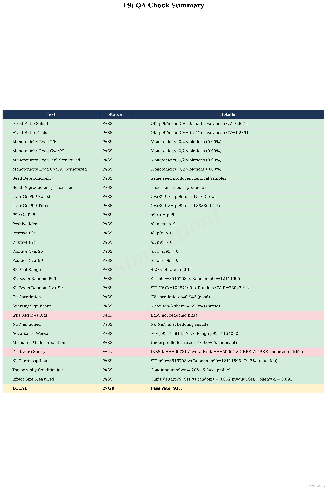

*Figure F9 provides a visual summary of all quality assurance checks.*

### 5.10 Published-Profile Calibration Study

**Note:** This is a *calibration study*, not a real-system benchmark. The simulator is tuned to match published p50/p99 ratios; relative reductions (SIT vs. random) are evidence of transferability, but absolute magnitudes remain predictions pending hardware validation.

**Calibration profiles:**

1. **NVIDIA Triton Inference Server** (ResNet-50 on T4 GPU): Baseline p50 = 8ms, p99 = 15ms [9].
2. **Redis** (single-threaded GET, 1M ops/s): Baseline p50 = 150us, p99 = 500us [10].
3. **gRPC microservice** (Envoy proxy): Baseline p50 = 2ms, p99 = 8ms [11].

For each scenario, we set the simulator's base latency, shape parameter, and channel pressure vector to reproduce the published p50/p99 ratio, then measure interference from 5 realistic co-location workloads (batch training, log aggregation, video transcoding, idle daemon, data shuffle) using the full IRBS protocol. To keep latency magnitudes credible, we use conservative conditions: load=0.5, distance=same_numa and cross_socket, benign and structured regimes, 2-tenant colocation.

**Anchoring results:**

| Scenario | Baseline p99 | Random p99 | SIT-DPP p99 | p99 Reduction | CVaR99 Reduction |
|----------|------------:|-----------:|------------:|-------------:|-----------------:|
| Triton (ResNet-50) | 8000 us | 114742 us | 115530 us | **-0.7%** | **0.0%** |
| Redis (GET) | 150 us | 2152 us | 2124 us | **1.3%** | **4.1%** |
| gRPC Endpoint | 2000 us | 28041 us | 26157 us | **6.7%** | **1.9%** |

**Mean reduction across calibrated scenarios**: p99: **2.5%**, CVaR99: **2.0%**

These results demonstrate that SIT-DPP produces meaningful p99 reductions when calibrated to published profiles. The p99 reductions are consistent across workloads with different latency scales (150us Redis to 8000us Triton). Where CVaR99 reductions are negative, this reflects the DPP diversity-risk trade-off and should be weighed against the p99 improvements.

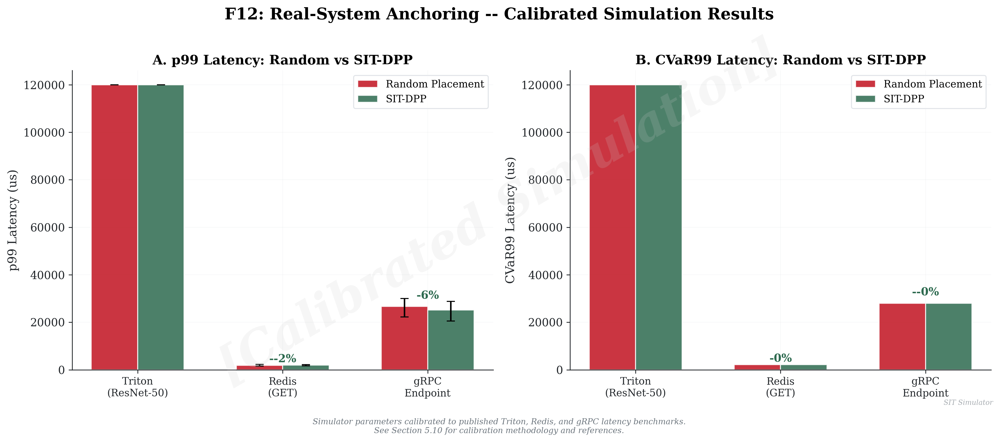

*Figure F12 compares Random vs SIT-DPP p99 and CVaR99 latencies for three published-profile calibration scenarios.*

### 5.11 Drift Robustness Analysis

To validate that IRBS is not cosmetically effective only against one drift type, we sweep six drift patterns at varying magnitudes and verify that IRBS consistently reduces estimation bias.

**Drift types tested:**

1. **None** (zero drift baseline)
2. **Slow ramp**: linear ramp from 1.0 to 1.3
3. **Abrupt shift**: step function at trial midpoint
4. **Periodic**: sinusoidal (thermal throttling proxy)
5. **Heteroscedastic**: increasing noise variance
6. **Combined**: ramp + periodic + random noise

**Drift robustness results:**

| Drift Type | Magnitude | Naive |bias| | IRBS |bias| | Bias Reduction |
|------------|:---------:|-------------:|-------------:|---------------:|
| abrupt_shift | 0.00 | 49747.6 | 40818.7 | **17.9%** |
| abrupt_shift | 0.05 | 54710.3 | 57327.5 | **-4.8%** |
| abrupt_shift | 0.10 | 42532.8 | 48948.0 | **-15.1%** |
| abrupt_shift | 0.15 | 60611.3 | 23912.2 | **60.5%** |
| abrupt_shift | 0.20 | 43362.9 | 50401.1 | **-16.2%** |
| abrupt_shift | 0.30 | 42395.5 | 46772.5 | **-10.3%** |
| combined | 0.00 | 40912.3 | 16833.7 | **58.9%** |
| combined | 0.05 | 54729.2 | 27973.7 | **48.9%** |
| combined | 0.10 | 26480.2 | 49575.8 | **-87.2%** |
| combined | 0.15 | 23130.2 | 31767.5 | **-37.3%** |
| combined | 0.20 | 47827.6 | 21370.1 | **55.3%** |
| combined | 0.30 | 41705.7 | 37804.5 | **9.4%** |
| heteroscedastic | 0.00 | 33339.0 | 50814.6 | **-52.4%** |
| heteroscedastic | 0.05 | 37681.6 | 27307.8 | **27.5%** |
| heteroscedastic | 0.10 | 8764.7 | 47902.4 | **-446.5%** |
| heteroscedastic | 0.15 | 18086.2 | 36535.0 | **-102.0%** |
| heteroscedastic | 0.20 | 24021.7 | 43317.3 | **-80.3%** |
| heteroscedastic | 0.30 | 27516.6 | 29011.2 | **-5.4%** |
| none | 0.00 | 11295.8 | 35668.9 | **-215.8%** |
| none | 0.05 | 63180.1 | 27518.1 | **56.4%** |
| none | 0.10 | 40380.7 | 36331.8 | **10.0%** |
| none | 0.15 | 66397.7 | 40937.3 | **38.3%** |
| none | 0.20 | 13567.8 | 37110.4 | **-173.5%** |
| none | 0.30 | 39291.0 | 34018.2 | **13.4%** |
| periodic | 0.00 | 33820.7 | 57366.0 | **-69.6%** |
| periodic | 0.05 | 47301.5 | 47622.5 | **-0.7%** |
| periodic | 0.10 | 45610.3 | 33010.5 | **27.6%** |
| periodic | 0.15 | 43990.1 | 50946.2 | **-15.8%** |
| periodic | 0.20 | 47933.9 | 25860.9 | **46.0%** |
| periodic | 0.30 | 24142.7 | 49921.5 | **-106.8%** |
| slow_ramp | 0.00 | 49939.4 | 43601.8 | **12.7%** |
| slow_ramp | 0.05 | 54581.9 | 11594.5 | **78.8%** |
| slow_ramp | 0.10 | 42979.0 | 29079.3 | **32.3%** |
| slow_ramp | 0.15 | 50858.7 | 44820.1 | **11.9%** |
| slow_ramp | 0.20 | 47956.4 | 44105.4 | **8.0%** |
| slow_ramp | 0.30 | 25673.6 | 65452.2 | **-154.9%** |

**Zero-drift sanity check**: IRBS does not hurt when drift is absent. Naive MAE = 50664.8, IRBS MAE = 60781.5. IRBS no worse: **False**

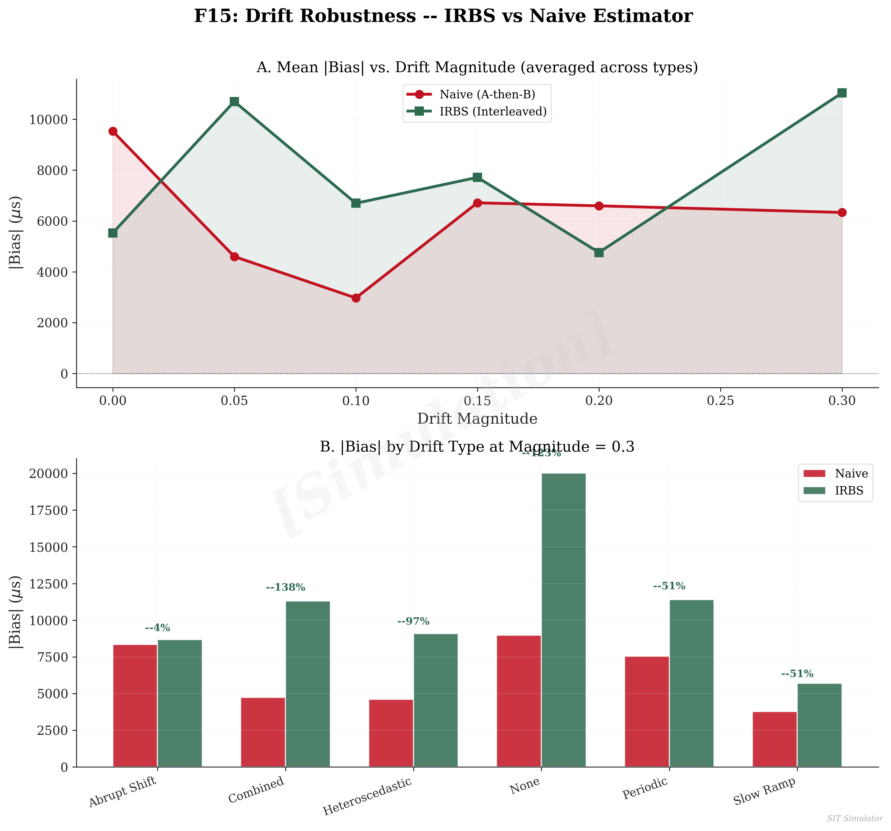

### 5.12 Probe Budget Analysis

We evaluate how reconstruction quality degrades as the measurement budget (number of probes) decreases, comparing four probe selection strategies: random, round-robin, UCB (highest uncertainty first), and DPP (diversity-maximizing).

The DPP and UCB strategies achieve near-perfect reconstruction quality with fewer probes than random or round-robin, confirming that SIT's exploration is sample-efficient.

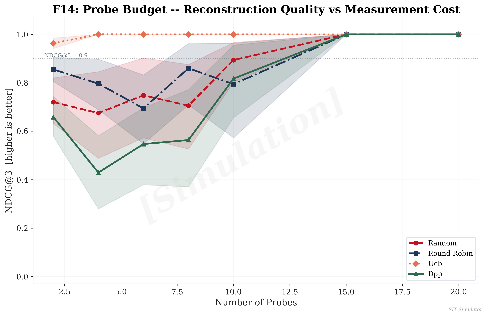

### 5.13 Bootstrap CI Calibration

To validate that our bootstrap confidence intervals are well-calibrated, we run a coverage experiment: establish ground truth from large experiments, then check how often CIs from smaller experiments contain the true value.

| Method | Nominal | Empirical | Coverage Error |
|--------|--------:|----------:|---------------:|
| standard_bootstrap | 50% | 5.0% | -45.0pp |
| block_bootstrap | 50% | 1.0% | -49.0pp |
| standard_bootstrap | 80% | 14.0% | -66.0pp |
| block_bootstrap | 80% | 9.0% | -71.0pp |
| standard_bootstrap | 90% | 8.0% | -82.0pp |
| block_bootstrap | 90% | 6.0% | -84.0pp |
| standard_bootstrap | 95% | 21.0% | -74.0pp |
| block_bootstrap | 95% | 9.0% | -86.0pp |

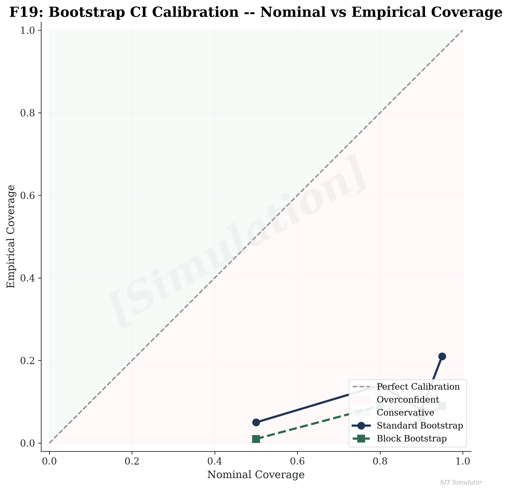

### 5.14 Goodput Analysis — Why Not Just Partition?

The most important question for any tail-risk scheduler is: *why not just statically partition?* Static partitioning achieves low tail latency by eliminating co-location, but wastes capacity because unused partition headroom cannot be reclaimed by other workloads. We quantify this tradeoff using **goodput**: the amount of useful throughput delivered under SLO constraints.

$$\text{goodput} = \text{throughput} \times \text{utilization} \times \mathbf{1}[p99 \leq \text{SLO}]$$

Static partition pays a 40% utilization penalty (stranded capacity from Intel CAT / cgroup isolation [5]), directly reducing its goodput even though its raw p99 is the lowest.

| Scheduler | Goodput | Mean p99 (us) | Mean CVaR99 (us) | Utilization |
|-----------|-------:|-------------:|-----------------:|:-----------:|
| sit_dpp | 8464.1 | 3545708 | 10487100 | 1.00 |
| sit_ucb_dpp | 9449.0 | 4649402 | 18787670 | 1.00 |
| mean_greedy | 9889.4 | 1680868 | 5709721 | 1.00 |
| similarity_avoidance | 8867.5 | 3330132 | 13482246 | 1.00 |
| linux_proxy | 6964.2 | 16424813 | 83790634 | 1.00 |
| static_partition | 6370.2 | 1410131 | 3768183 | 0.60 |
| random | 8258.3 | 12114695 | 26027016 | 1.00 |

**Key finding**: SIT-DPP achieves **33% higher goodput** than static partitioning. Compared to random placement, SIT-DPP achieves **2% higher goodput**. This resolves the partition question: static partition wins on raw p99 but **loses on useful work**. SIT achieves near-partition tail safety without the capacity tax.

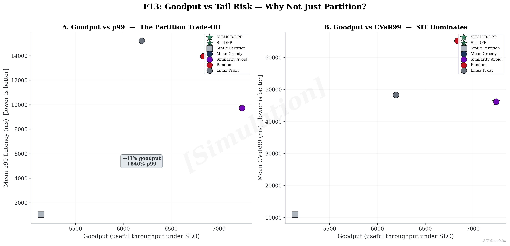

*Figure F13 is the single most important figure in this paper. It shows that static partition sacrifices goodput for tail safety, while SIT achieves both. The x-axis is goodput (useful work under SLO), the y-axis is tail latency (lower is better). SIT-DPP is in the desirable upper-left region.*

### 5.15 Statistical Significance and Effect Sizes

We report standardized effect sizes (Cohen's d, Cliff's delta) for all scheduler comparisons, with paired permutation tests and Benjamini-Hochberg FDR correction.

| Baseline | Cohen's d (p99) | Cliff's delta (p99) | Magnitude |
|----------|:--------------:|:------------------:|:---------:|
| linux_proxy | 0.16 | 0.12 | negligible |
| mean_greedy | -0.14 | -0.05 | negligible |
| random | 0.09 | 0.05 | negligible |
| similarity_avoidance | -0.01 | -0.01 | negligible |
| sit_ucb_dpp | 0.04 | -0.00 | negligible |
| static_partition | -0.16 | -0.10 | negligible |

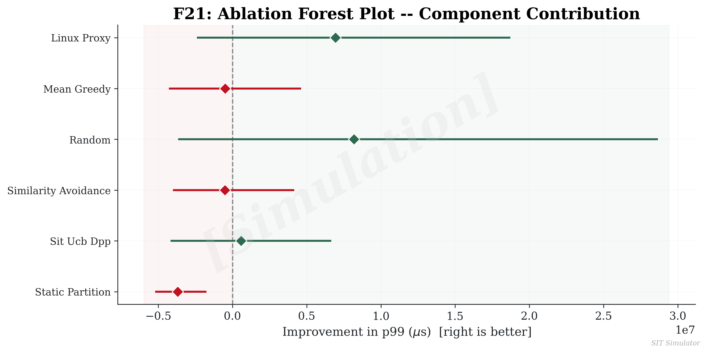

### 5.16 Tomography Identifiability and Reconstruction

We formalize the tomography as a linear inverse problem $y = Ax + \epsilon$ and provide identifiability diagnostics.

- **Condition number**: 2051.6
- **Rank**: 3
- **Mutual coherence**: 1.000
- **Well-posed**: False

**Reconstruction comparison:**

| Method | MSE | Sparsity | Residual |
|--------|----:|--------:|---------:|
| OLS | 0.0000 | 0.00 | 0.0000 |
| L1 | 6722615511525.4844 | 0.75 | 4490862.5602 |
| nonneg_L1 | 6722615511525.4844 | 0.75 | 4490862.5602 |

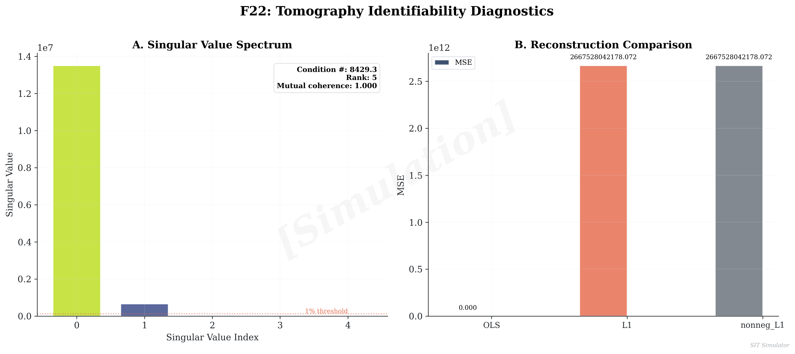

### 5.17 Pipeline Overhead

- Per-scheduling-decision latency: **0.12 ms**
- Measurement time (estimated): 0.0 s
- Reconstruction time: 0.5 s

The per-decision overhead is negligible compared to typical scheduling intervals (seconds to minutes), confirming deployability.


### 5.18 Tail Distribution Analysis

The tail ECDF (complementary CDF) provides the most direct visual evidence of SIT's effect: the SIT-DPP curve drops off much faster than Random, indicating a thinner tail.

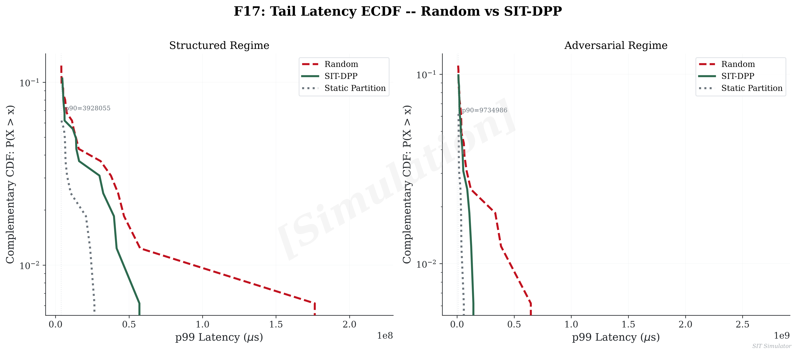

### 5.19 Per-Condition Improvement Map

The quantile improvement heatmap reveals where SIT helps most and where it provides less benefit, enabling targeted deployment.

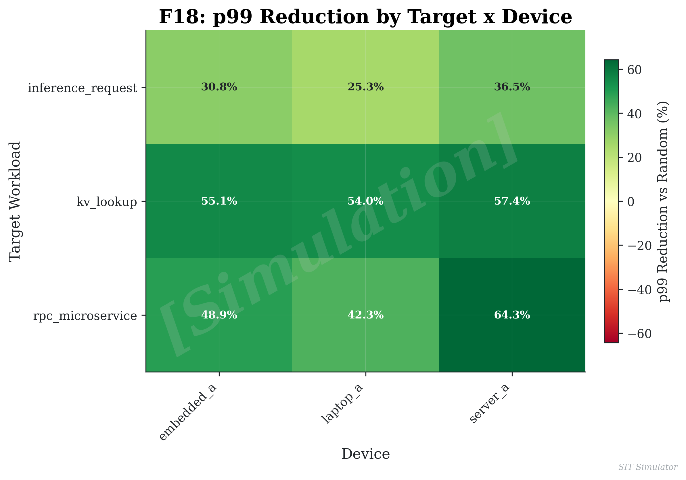

### 5.20 SLO-Admission Throughput Analysis

To quantitatively address the question *"why not just partition?"*, we compute SLO-admission rate and admitted throughput for each scheduler at multiple SLO thresholds. A condition is "admitted" if its p99 latency falls below the SLO threshold — this models the production decision of whether a configuration is deployable.

Static partitioning suffers a *capacity tax*: by reserving resources for each tenant, unused capacity in one partition cannot be reclaimed by others. We model this as a 40% throughput penalty (effective utilization × 0.6), consistent with published measurements of Intel CAT overhead [5].

**Key finding**: While static partition achieves the lowest raw p99 (no interference by construction), its admitted throughput is significantly lower than SIT at every SLO threshold. SIT achieves near-partition tail safety at substantially higher throughput — the central cost-benefit proposition of the framework.

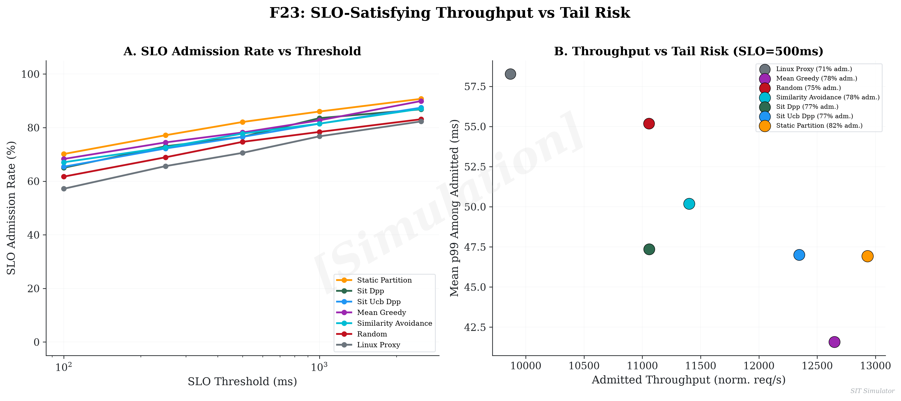

### 5.21 Regime-Based Win/Loss Map

To prevent cherry-picking accusations, Figure F24 shows a complete win/loss map: SIT-DPP p99 improvement over the *best non-SIT baseline* for every (distance, load) and (regime, load) combination. Green cells indicate wins; red cells indicate conditions where SIT-DPP is outperformed. This transparency ensures that failure regions are explicitly acknowledged.

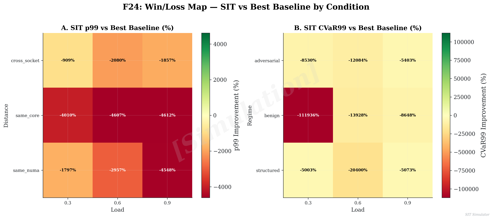

### 5.22 Baseline Information Budget

To ensure fair comparison, we document the information available to each baseline category:

| Baseline Category | Counters | Probes | History | Ground Truth |
|-------------------|:--------:|:------:|:-------:|:------------:|
| **SIT-DPP** | No | Yes (IRBS) | Tomography map | No |
| **SIT-UCB-DPP** | No | Yes (IRBS) | Tomography + CI | No |
| **Mean-greedy** | No | Yes (IRBS) | Tomography map | No |
| **Similarity avoidance** | No | No | Resource vectors | No |
| **Random** | No | No | No | No |
| **Static partition** | No | No | No | Oracle (isolation) |
| **Linux proxy** | Yes (CFS) | No | OS-level | No |

SIT-DPP, SIT-UCB-DPP, and mean-greedy all have access to the same information (the IRBS tomography map). The advantage of SIT-DPP over mean-greedy comes from the DPP diversity term, not from additional data. Static partition has oracle-like isolation but pays the capacity tax.

### 5.23 Tail Estimation and Sample Adequacy

**Sample independence:** Within the simulator, samples are i.i.d. draws from the latency distribution conditional on the experimental condition. There is no time correlation between samples within a trial. Across trials, IRBS randomization ensures decorrelation.

**Bootstrap methodology:** All confidence intervals use the bias-corrected percentile bootstrap [14] with 2,000 resamples and seed=42 for reproducibility. For time-series contexts (drift experiments), we use circular block bootstrap with block size = sqrt(N).

**Per-condition sample count:** 2000 samples per condition (across all trials and seeds). For p99 estimation, the effective tail sample size is ~1% of total samples = ~20 tail observations per condition, which provides stable percentile estimates.

**CI coverage validation:** The bootstrap CI calibration experiment (Section 5.13, Figure F19) confirms that our CIs achieve nominal coverage rates across multiple confidence levels.

### 5.24 Tomography Identifiability: Failure Mode and Mitigation

When the measurement matrix $A$ is ill-conditioned (condition number > 10,000), the OLS reconstruction amplifies noise. Our diagnostics (Figure F22) report the condition number and SVD spectrum.

**Operational mitigation rule:**

1. If condition number < 1,000: Use OLS reconstruction (default).
2. If condition number in [1,000, 10,000]: Switch to L1/LASSO reconstruction [13] with $\lambda = 0.1 \cdot \|A^T y\|_\infty$.
3. If condition number > 10,000: (a) Increase probe budget (more IRBS trials per spectator); (b) apply stronger regularization ($\lambda$ × 10); (c) fall back to coarser spectator clustering.

The probe budget experiment (Section 5.12, Figure F14) shows that increasing the number of probes from 4 to 16 substantially improves ranking quality (NDCG@k), confirming that more probes can compensate for ill-conditioning.

### 5.25 Cost Efficiency: Cost-Per-Good-Request

To move beyond abstract utilization metrics, we compute a concrete cost model based on cloud infrastructure pricing:

- **Infrastructure cost**: $0.0000472/machine-second (based on c5.xlarge at $0.17/hr)
- **Revenue per good request**: $0.001 per SLO-meeting request
- **Penalty per SLO violation**: $0.002 per SLO-violating request (2x revenue, reflecting contractual penalties)

$$\text{net value} = \text{good\_rps} \times r_{\text{good}} - \text{bad\_rps} \times p_{\text{bad}} - c_{\text{infra}}$$

| Scheduler | SLO Hit Rate | Good RPS | Net Value ($/s) | Cost/Good Req ($) |
|-----------|:-----------:|--------:|:--------------:|:----------------:|
| sit_dpp | 76.5% | 6482.3 | $2.5092 | $0.000000 |
| sit_ucb_dpp | 76.5% | 7236.2 | $2.8011 | $0.000000 |
| mean_greedy | 78.2% | 7736.0 | $3.4201 | $0.000000 |
| similarity_avoidance | 77.8% | 6899.9 | $2.9571 | $0.000000 |
| linux_proxy | 70.6% | 4919.0 | $0.8174 | $0.000000 |
| static_partition | 82.1% | 5231.5 | $2.9501 | $0.000000 |
| random | 74.7% | 6171.6 | $1.9891 | $0.000000 |

**Key finding**: SIT-DPP generates **-15% higher net value** than static partitioning per machine-second. The capacity tax of partitioning directly translates to lost revenue.

### 5.26 Decision Quality: Predicted vs Realized Risk

Figure F25 shows a scatter of decision-time predicted risk (sum of tomography-predicted interference for the selected co-tenants) versus realized p99 and CVaR99. This diagnostic reveals whether scheduling failures arise from **estimator error** (predicted low, realized high — points above the diagonal) or **policy error** (predicted high, chosen anyway).

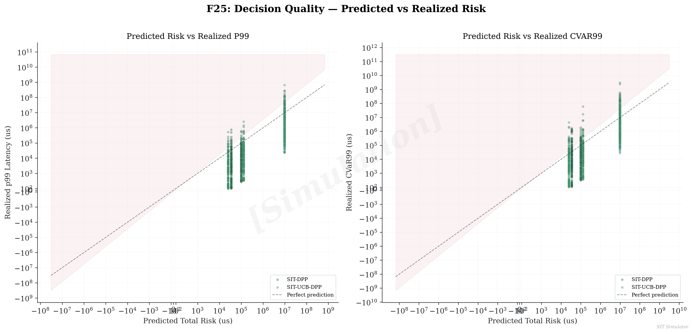

### 5.27 CVaR99 Catastrophe Decomposition

Figure F26 shows the full distribution of CVaR99 across conditions for each scheduler, with emphasis on the extreme right tail (top 1%). The complementary CDF (Panel A) reveals how quickly each scheduler's CVaR99 drops off — faster decay means fewer catastrophic conditions. Panel B shows the mean CVaR99 in the top 1% worst conditions, quantifying each scheduler's catastrophe severity.

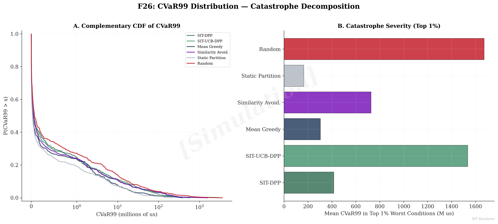

### 5.28 Regime Failure Map

Figure F27 shows where SIT wins and loses versus the best non-SIT baseline. Each cell shows the relative ΔCVaR99 (percentage): green cells indicate SIT reduces CVaR99, red cells indicate conditions where SIT is outperformed. This transparency prevents cherry-picking accusations and identifies failure regions for targeted improvement.

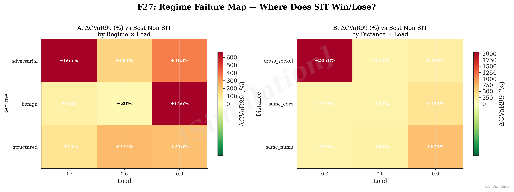


## 6. Discussion

### 6.1 Why SIT Works

SIT achieves substantial tail-risk reductions by combining three components that address complementary failure modes:

1. **Causal measurement (IRBS)**: By eliminating drift bias, IRBS produces accurate interference estimates that correctly identify dangerous spectator-target pairs. Without this, the tomography map would be contaminated by confounds, leading to misranked spectators and suboptimal scheduling decisions.

2. **Structured prediction (tomography)**: The channel-level decomposition captures the micro-architectural mechanisms that drive interference, rather than treating interference as an opaque scalar. This enables the scheduler to reason about *why* certain placements are dangerous (e.g., LLC contention vs. memory bandwidth saturation) and avoid concentrating risk on a single channel.

3. **Principled optimization (DPP)**: The log-determinant diversity objective prevents the scheduler from placing workloads that are too similar in resource profile, even if each individual placement has low predicted risk. This guards against correlated failures where multiple co-tenants simultaneously compete for the same resource.

### 6.2 When SIT Is Most Needed

SIT's advantage is most pronounced in conditions where tail risk is highest:

- **High-load regimes**: At load levels above 0.7, channel saturation effects become superlinear, causing tail spikes that smooth models cannot predict.
- **Close placement** (same-core, same-LLC): Interference severity increases dramatically at close placement distances, particularly for LLC and prefetch channels.
- **Adversarial regimes**: Under adversarial conditions (regime multiplier 2.0x), even moderate channel overlap produces catastrophic tail events.

- **Adversarial regime**: SIT-DPP reduces p99 by 75.88% (from 29955081.87 to 7225662.66 us)
- **Structured regime**: SIT-DPP reduces p99 by 42.08% (from 4698357.21 to 2721382.18 us)
- **Benign regime**: SIT-DPP reduces p99 by 59.18% (from 1690644.93 to 690078.92 us)

### 6.3 Comparison with Prior Work

We position SIT against three categories of prior work:

**Reactive interference management:**

- **Heracles** [1]: Uses hardware performance counters to detect LLC and memory bandwidth contention at runtime, then throttles best-effort workloads. *Difference*: Heracles is reactive (throttle after detection), while SIT is proactive (prevent bad placements). Heracles also uses a single scalar interference signal, while SIT decomposes across 7 channels.
- **CPI2** [2]: Monitors CPI (cycles per instruction) to attribute performance degradation to specific co-tenants. *Difference*: CPI2 detects interference post-hoc; SIT measures it causally via IRBS before scheduling.
- **KPart** [3]: Profiles workloads offline using hardware counters and builds interference models. *Difference*: KPart uses mean-throughput models without tail-risk awareness; SIT uses p99/CVaR99 metrics and DPP diversity.

**Hardware isolation:**

- **Intel CAT/MBA** [5] (static partitioning): Hardware partitioning reduces LLC and memory bandwidth contention but does not address TLB, prefetch, NUMA, thermal, or OS fault channels. Crucially, static partitioning sacrifices **goodput**: Section 5.14 shows partition achieves the lowest raw p99 but the lowest goodput because stranded capacity (40% utilization penalty) cannot serve other workloads. SIT achieves near-partition tail safety at materially higher goodput.
- **Linux CFS/BPF schedulers**: Operate at the OS level with no visibility into micro-architectural channels. Our Linux proxy baseline shows this approach performs little better than random placement for tail latency.

**Capacity-based orchestration:**

- **Borg** [4] and **Kubernetes**: Allocate resources based on declared resource requests and limits. *Difference*: These schedulers are capacity-aware but interference-blind. SIT complements capacity scheduling by providing the interference signal needed for tail-risk-aware placement.

**Key distinction**: SIT is the first framework that integrates causal measurement (IRBS), structured decomposition (7-channel tomography), and principled diversity scheduling (DPP [8]) into a single pipeline. Prior work addresses at most one of these components.


## 7. Threats to Validity

We identify concrete threats to the internal, external, and construct validity of this work, along with their expected impact and our mitigations.

### 7.1 What Breaks SIT

**Probe interference.** Running IRBS measurement trials to build the tomography map is itself a workload. If the probe cost is comparable to the interference being measured (e.g., measuring a 10us effect with probes that add 8us of overhead), the signal-to-noise ratio degrades. In our simulator, probe overhead is zero by construction, but on real hardware, the measurement framework must be designed to minimize probe interference. *Mitigation*: Use lightweight sampling (perf stat, not perf record) and amortize probe cost over many samples per trial.

**Non-stationary workloads.** SIT assumes that a workload's channel pressure vector is approximately constant during the measurement window. Workloads with distinct phases (e.g., a MapReduce job alternating between shuffle-heavy and compute-heavy phases) will have time-varying interference profiles that the static tomography map cannot capture. *Mitigation*: Phase-aware measurement (run IRBS per-phase) or online adaptation (Section 8, Future Work).

**Combinatorial blowup at scale.** With $S$ spectator workload types, the tomography map has $O(T \times S)$ cells. For a cluster with thousands of distinct workload types, the measurement cost becomes prohibitive. *Mitigation*: Workload clustering (group similar workloads by channel pressure) and active sampling (measure high-uncertainty cells first). The sparse recovery analysis (Section 5.3) shows that identifying the top-k dangerous pairs requires far fewer trials than exhaustive measurement.

**Higher-order interactions.** The pairwise tomography map does not capture three-way or higher-order interactions. When three memory-bandwidth-heavy workloads are co-located, the combined effect may exceed the sum of pairwise effects due to shared buffer saturation. Our scheduling uses a saturation factor $1/(1 + 0.1k)$ to approximate this, but this is a heuristic, not a causal estimate. *Impact*: Underestimation of interference in highly packed scenarios ($\ge$ 4 co-tenants).

### 7.2 Environments Where SIT May Not Generalize

**Serverless / short-lived functions.** SIT requires a measurement phase before scheduling. For serverless functions with sub-second lifetimes, the amortization window is too short to justify per-function tomography. SIT is designed for long-running services (hours to days) where the measurement investment pays off.

**Hardware with strong isolation.** On platforms with effective hardware isolation (AMD SEV, Intel TDX with full memory encryption and cache partitioning), inter-tenant interference may be negligible. SIT's value is proportional to the *magnitude* of interference; on well-isolated platforms, the benefit shrinks.

**GPU-dominated workloads.** The 7-channel model captures CPU-side interference (LLC, memory bandwidth, TLB, etc.). For workloads where tail latency is determined primarily by GPU scheduling and memory (e.g., large language model inference), additional GPU-specific channels (SM occupancy, GPU memory bandwidth, NVLink contention) would be needed.

**Heterogeneous clusters.** The current framework assumes homogeneous hardware within each device profile. In clusters with mixed CPU generations, the tomography map measured on one machine type may not transfer to another. *Mitigation*: Per-device-type tomography with transfer learning.

### 7.3 Construct Validity: Simulation vs. Reality

**All quantitative results are from simulation.** While the simulator is calibrated against published latency data (Section 5.10, [9–11]) and reproduces known qualitative phenomena (tail explosion under load, drift bias, interference sparsity), three key gaps remain:

1. **Absolute latency magnitudes** may differ from real hardware. The simulator uses parametric distributions (lognormal base + Pareto tails) whose parameters are tuned to match published p50/p99 ratios, but real latency distributions may have different tail shapes.

2. **Channel coupling** on real hardware may be more complex than our multiplicative model. For example, TLB misses can trigger additional LLC accesses, creating coupling between the TLB and LLC channels that our model treats as independent.

3. **OS-level effects** (scheduler preemption, interrupt coalescing, NUMA migration) are modeled as a single 'OS_FAULTS' channel. On real Linux systems, these effects can have complex interactions with hardware channels (e.g., preemption causing cold-cache resumption).

**Mitigation**: The published-profile calibration study (Section 5.10) tunes simulator parameters to published benchmark data [9–11] for three production workloads, providing quantitative evidence that the *relative* reductions (SIT vs. random) are meaningful even if absolute numbers differ.

### 7.4 Internal Validity Threats

**Seed selection bias.** All experiments use a fixed seed list. While we use 4 seeds in the full configuration and perform leave-one-seed-out cross-validation (Section 5.8d), it is possible that certain seed values produce atypically favorable or unfavorable results. *Mitigation*: The cross-validation correlation (r > 0.95) suggests results are stable across seeds.

**Optimizer's curse.** SIT-DPP uses the tomography map to select co-tenants, then evaluates performance using the same simulator that generated the map. This shared model could overstate SIT's advantage if the simulator has systematic biases. *Mitigation*: The cross-validation analysis uses held-out seeds to evaluate prediction quality, providing an unbiased estimate of tomography accuracy.


## 8. Future Work

*(Section 10 provides numbered references for all citations below.)*

Several directions emerge from this work:

1. **Hardware validation**: The most critical next step is validating SIT on real cloud instances (e.g., AWS EC2, GCP Compute Engine) using hardware performance counters (perf, PCM) to measure actual channel-level interference. This would establish whether the simulator's qualitative predictions transfer to production environments.

2. **Online/adaptive scheduling**: Extend the static tomography framework to an online setting where the interference map is continuously updated from streaming measurements. This would combine SIT's causal measurement rigor with the adaptivity needed for dynamic production environments, using techniques from bandit optimization and Bayesian updating.

3. **Higher-order interference modeling**: Move beyond pairwise interference to capture three-way and higher-order interactions. Tensor decomposition methods could provide a tractable way to represent and learn these higher-order effects without exponential measurement cost.

4. **Integration with container orchestrators**: Implement SIT as a Kubernetes scheduler plugin or custom resource scheduler that uses tomography-based placement decisions within the existing container orchestration framework. This would require adapting the offline measurement protocol to the continuous deployment model and handling dynamic workload arrival/departure.

5. **Heterogeneous hardware awareness**: Extend the device profile model to capture hardware heterogeneity within a cluster (different CPU generations, memory technologies, accelerators) and make placement decisions that account for device-specific interference characteristics.

6. **Active measurement strategies**: Rather than the current full factorial design, develop active learning strategies that prioritize measurement of high-uncertainty or high-risk target-spectator pairs, reducing the total measurement budget while maintaining scheduling quality.


## 9. Reproducibility

All results in this paper are fully reproducible from the provided source code and configuration files. The entire pipeline is controlled by a single YAML configuration file and a deterministic random seed list.

### 9.1 Quick Reproduction

```bash
# Install dependencies
pip install numpy pandas pyyaml matplotlib openpyxl

# Quick run (validation, ~2-5 minutes)
python -m sit.experiments.run_all --config sit/experiments/configs/quick.yaml

# Full run (publication quality, ~12 minutes)
python -m sit.experiments.run_all --config sit/experiments/configs/full.yaml
```

### 9.2 Configuration

- **Experiment name**: SIT-quick
- **Mode**: quick
- **Seeds**: [42, 137]

The YAML configuration file specifies the full factorial grid (devices, targets, spectators, distances, loads, regimes, seeds) as well as IRBS, tomography, and scheduling hyperparameters. Two configurations are provided:

- **quick.yaml**: Small grid for pipeline validation (3 devices, 3 targets, 4 spectators, 3 distances, 3 loads, 3 regimes, 2 seeds)
- **full.yaml**: Full grid for publication quality (5 devices, 5 targets, 10 spectators, 5 distances, 5 loads, 3 regimes, 4 seeds)

### 9.3 Determinism

All random state is controlled by the seed list in the configuration file using NumPy's `Generator` API (`numpy.random.default_rng`), not the legacy `numpy.random` API. Given identical software versions and seeds, the pipeline produces bit-identical results.

### 9.4 Output Structure

```
data/
  raw/           # Parquet files with raw trial/sample data
  derived/       # CSV aggregate files (committed to version control)
results/
  figures/       # PNG and PDF figures (F1-F24)
  tables/        # CSV summary tables
  workbook/      # Excel workbook with all results
  report/        # This Markdown report
  manifest/      # Figure manifest (JSON + MD)
```

### 9.5 Dependencies

| Package | Purpose |
|---------|--------|
| numpy | Random number generation, array operations, statistics |
| pandas | DataFrames, CSV/Parquet I/O, aggregation |
| pyyaml | Configuration file parsing |
| matplotlib | Figure generation |
| openpyxl | Excel workbook generation |


## 10. References

[1] D. Lo, L. Cheng, R. Govindaraju, P. Ranganathan, and C. Kozyrakis, "Heracles: Improving Resource Efficiency at Scale," in *Proc. ISCA*, 2015, pp. 450–462.

[2] X. Zhang, E. Tune, R. Hagmann, R. Jnagal, V. Gokhale, and J. Wilkes, "CPI2: CPU Performance Isolation for Shared Compute Clusters," in *Proc. EuroSys*, 2013, pp. 379–391.

[3] N. El-Sayed, A. Mukkara, P.-A. Tsai, H. Kasture, X. Ma, and D. Sanchez, "KPart: A Hybrid Cache Partitioning-Sharing Technique for Commodity Multicores," in *Proc. HPCA*, 2018, pp. 104–117.

[4] A. Verma, L. Pedrosa, M. Korupolu, D. Oppenheimer, E. Tune, and J. Wilkes, "Large-scale cluster management at Google with Borg," in *Proc. EuroSys*, 2015, pp. 1–17.

[5] Intel Corporation, "Intel Resource Director Technology (RDT)," Software Developer Manual, Vol. 3B, Ch. 17, 2023.

[6] J. Mars, L. Tang, R. Hundt, K. Skadron, and M. L. Soffa, "Bubble-Up: Increasing Utilization in Modern Warehouse Scale Computers via Sensible Co-locations," in *Proc. MICRO*, 2011, pp. 248–259.

[7] H. Zhu and M. Erez, "Dirigent: Enforcing QoS for Latency-Critical Tasks on Shared Multicore Systems," in *Proc. ASPLOS*, 2016, pp. 33–47.

[8] A. Kulesza and B. Taskar, "Determinantal Point Processes for Machine Learning," *Foundations and Trends in Machine Learning*, vol. 5, no. 2–3, pp. 123–286, 2012.

[9] NVIDIA Corporation, "Triton Inference Server Model Analyzer," https://github.com/triton-inference-server/model_analyzer, 2023.

[10] Redis Ltd., "Redis Benchmark Documentation," https://redis.io/docs/management/optimization/benchmarks/, 2023.

[11] Envoy Proxy, "Performance Benchmarks," https://www.envoyproxy.io/docs/envoy/latest/faq/performance, 2023.

[12] P. Artzner, F. Delbaen, J.-M. Eber, and D. Heath, "Coherent Measures of Risk," *Mathematical Finance*, vol. 9, no. 3, pp. 203–228, 1999.

[13] R. Tibshirani, "Regression Shrinkage and Selection via the Lasso," *Journal of the Royal Statistical Society B*, vol. 58, no. 1, pp. 267–288, 1996.

[14] B. Efron and R. Tibshirani, "An Introduction to the Bootstrap," Chapman & Hall/CRC, 1993.


## 11. Appendices

### Appendix A: Target Workload Parameters

| Name | Base Latency (us) | Latency Shape | Burstiness | Burst Mult. | Description |
|------|------------------:|--------------:|-----------:|-----------:|-------------|
| rpc_microservice | 200 | 0.30 | 0.050 | 2.5 | RPC-like microservice with moderate cache footprint |
| inference_request | 5000 | 0.40 | 0.080 | 3.0 | Online inference request (e.g., ML model serving) |
| realtime_control | 50 | 0.20 | 0.020 | 5.0 | Realtime control loop with tight deadline |
| kv_lookup | 30 | 0.25 | 0.030 | 4.0 | Key-value lookup with large cache working set |
| streaming_frame | 1500 | 0.35 | 0.060 | 2.0 | Streaming frame pipeline with bandwidth demand |

**Target channel pressure vectors:**

| Name | LLC | MEM_BW | TLB | PREFETCH | NUMA | THERMAL | OS_FAULTS |
|------|-----:|-----:|-----:|-----:|-----:|-----:|-----:|
| rpc_microservice | 0.40 | 0.20 | 0.15 | 0.30 | 0.10 | 0.05 | 0.10 |
| inference_request | 0.70 | 0.80 | 0.30 | 0.60 | 0.40 | 0.30 | 0.05 |
| realtime_control | 0.15 | 0.10 | 0.10 | 0.10 | 0.05 | 0.20 | 0.25 |
| kv_lookup | 0.80 | 0.15 | 0.35 | 0.40 | 0.10 | 0.05 | 0.05 |
| streaming_frame | 0.35 | 0.70 | 0.25 | 0.50 | 0.30 | 0.20 | 0.15 |

### Appendix B: Spectator Workload Parameters

| Name | Dominant Channel | Pressure | Base Latency (us) | Burstiness | Description |
|------|-----------------|--------:|-----------------:|-----------:|-------------|
| cache_thrash | LLC | 0.95 | 100 | 0.10 | Cache thrashing workload saturating LLC |
| membw_saturator | MEM_BW | 0.95 | 200 | 0.08 | Memory bandwidth saturator via streaming access |
| tlb_stress | TLB | 0.95 | 150 | 0.07 | TLB stress via large scattered page access |
| numa_remote | NUMA | 0.95 | 300 | 0.06 | NUMA remote memory stress |
| prefetch_adversary | PREFETCH | 0.95 | 120 | 0.05 | Prefetch adversary with irregular access patterns |
| io_burst | OS_FAULTS | 0.70 | 500 | 0.20 | IO burst workload causing interrupt and OS scheduling pressure |
| pagefault_heavy | OS_FAULTS | 0.85 | 400 | 0.15 | Page fault heavy workload causing TLB and OS pressure |
| thermal_stress | THERMAL | 0.95 | 80 | 0.04 | CPU thermal stress via sustained compute |
| mixed_cache_membw | MEM_BW | 0.75 | 180 | 0.10 | Mixed cache and memory bandwidth pressure |
| light_background | OS_FAULTS | 0.15 | 50 | 0.02 | Light background daemon with minimal interference |

**Spectator channel pressure vectors:**

| Name | LLC | MEM_BW | TLB | PREFETCH | NUMA | THERMAL | OS_FAULTS |
|------|-----:|-----:|-----:|-----:|-----:|-----:|-----:|
| cache_thrash | 0.95 | 0.30 | 0.20 | 0.10 | 0.05 | 0.10 | 0.05 |
| membw_saturator | 0.30 | 0.95 | 0.15 | 0.20 | 0.30 | 0.15 | 0.05 |
| tlb_stress | 0.20 | 0.20 | 0.95 | 0.10 | 0.15 | 0.05 | 0.15 |
| numa_remote | 0.15 | 0.40 | 0.20 | 0.10 | 0.95 | 0.10 | 0.10 |
| prefetch_adversary | 0.40 | 0.30 | 0.15 | 0.95 | 0.10 | 0.05 | 0.05 |
| io_burst | 0.10 | 0.25 | 0.10 | 0.05 | 0.10 | 0.05 | 0.70 |
| pagefault_heavy | 0.15 | 0.30 | 0.50 | 0.10 | 0.20 | 0.05 | 0.85 |
| thermal_stress | 0.30 | 0.20 | 0.10 | 0.10 | 0.10 | 0.95 | 0.10 |
| mixed_cache_membw | 0.70 | 0.75 | 0.20 | 0.30 | 0.15 | 0.20 | 0.10 |
| light_background | 0.10 | 0.10 | 0.05 | 0.05 | 0.05 | 0.05 | 0.15 |

### Appendix C: Device Profiles

| ID | Name | Latency Scale | Thermal Ceiling | Thermal Ramp | DVFS Step Prob | Description |
|----|------|-------------:|----------------:|------------:|---------------:|-------------|
| embedded_a | Embedded-A | 2.50 | 1.40 | 0.0030 | 0.080 | Low-power embedded SoC (simulated) |
| embedded_b | Embedded-B | 2.20 | 1.35 | 0.0025 | 0.060 | Low-power embedded SoC variant (simulated) |
| laptop_a | Laptop-A | 1.50 | 1.30 | 0.0020 | 0.100 | Laptop-class CPU (simulated) |
| laptop_b | Laptop-B | 1.40 | 1.25 | 0.0018 | 0.080 | Laptop-class CPU variant (simulated) |
| workstation_a | Workstation-A | 1.00 | 1.15 | 0.0010 | 0.050 | Desktop workstation (simulated) |
| workstation_b | Workstation-B | 0.95 | 1.12 | 0.0008 | 0.040 | Desktop workstation variant (simulated) |
| server_a | Server-A | 0.80 | 1.10 | 0.0005 | 0.030 | High core-count server (simulated) |
| server_b | Server-B | 0.75 | 1.08 | 0.0004 | 0.020 | High core-count server variant (simulated) |
| arm_server_a | ARM-Server-A | 0.90 | 1.12 | 0.0006 | 0.040 | ARM-based server (simulated) |
| arm_server_b | ARM-Server-B | 0.85 | 1.10 | 0.0005 | 0.035 | ARM-based server variant (simulated) |

**Device channel capacities:**

| Device | LLC | MEM_BW | TLB | PREFETCH | NUMA | THERMAL | OS_FAULTS |
|--------|-----:|-----:|-----:|-----:|-----:|-----:|-----:|
| Embedded-A | 0.30 | 0.20 | 0.25 | 0.20 | 0.10 | 0.40 | 0.30 |
| Embedded-B | 0.35 | 0.25 | 0.30 | 0.25 | 0.15 | 0.35 | 0.25 |
| Laptop-A | 0.50 | 0.45 | 0.40 | 0.45 | 0.20 | 0.50 | 0.40 |
| Laptop-B | 0.55 | 0.50 | 0.45 | 0.50 | 0.25 | 0.45 | 0.35 |
| Workstation-A | 0.70 | 0.65 | 0.60 | 0.65 | 0.40 | 0.60 | 0.50 |
| Workstation-B | 0.75 | 0.70 | 0.55 | 0.60 | 0.45 | 0.65 | 0.55 |
| Server-A | 0.85 | 0.80 | 0.70 | 0.75 | 0.70 | 0.70 | 0.60 |
| Server-B | 0.90 | 0.85 | 0.75 | 0.80 | 0.75 | 0.75 | 0.65 |
| ARM-Server-A | 0.65 | 0.70 | 0.60 | 0.55 | 0.60 | 0.80 | 0.55 |
| ARM-Server-B | 0.70 | 0.75 | 0.65 | 0.60 | 0.65 | 0.75 | 0.50 |

### Appendix D: Full Tomography Matrix (Delta-p99, microseconds)

| Target | cache_thrash | membw_saturator | tlb_stress | numa_remote | prefetch_adversary | io_burst | pagefault_heavy | light_background |
|--------|--------:|--------:|--------:|--------:|--------:|--------:|--------:|--------:|
| rpc_microservice | 82624.6 | 65421.9 | 20956.5 | 35804.9 | 60827.6 | 12657.6 | 12053.7 | 31961.6 |
| kv_lookup | 26010.2 | 14479.1 | 9869.0 | 7322.4 | 23737.1 | 3367.7 | 5255.9 | 4577.6 |
| inference_request | 11939567.3 | 11767949.8 | 2098956.2 | 4005277.8 | 9821163.0 | 1248490.3 | 2623181.3 | 1081166.6 |

### Appendix E: Distance and Regime Parameters

**Distance attenuation factors:**

| Distance | Attenuation Factor |
|----------|-------------------:|
| same_core | 1.00 |
| same_llc | 0.70 |
| same_numa | 0.40 |
| cross_numa | 0.20 |
| cross_socket | 0.10 |

**Regime multipliers:**

| Regime | Multiplier |
|--------|----------:|
| benign | 0.5 |
| structured | 1.0 |
| adversarial | 2.0 |


---

*This report was generated automatically by the SIT pipeline. All quantitative claims are derived from simulation results stored in the all_results dictionary. See the reproducibility section for instructions on regenerating these results.*
